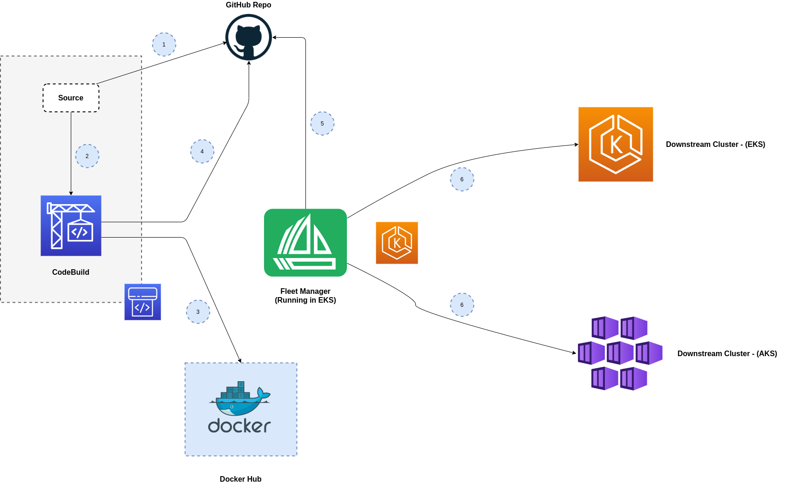

# CI For GitOps Pipeline 
This repository contains source code for a project that demonstrates creation of a CI/CD pipeline to automate deployments to a Kubernetes cluster using AWS CodeBuild for CI and Fleet as a GitOps tool.



## Requirements/Prerequisites
- [AWS](https://aws.amazon.com/)
- [Terraform](https://www.terraform.io/)

## Create Kubernetes Clusters with Terraform & Installation of Fleet GitOps tool
In order for you to have the full CI/CD workflow, you will need Kubernetes clusters for Fleet manager and other downstream clusters for deployments. The repository with the source code to provision K8s clusters in EKS, GKE and AKS can be [found here](https://github.com/LukeMwila/fleet-multi-cluster-cd). There is a README on how to install Fleet on EKS to manage deployments to the other downstream clusters. 

## Project Structure
```
├── README.md
├── application
├── iac
├── import-source-credentials.json
├── k8s-manifests
└── kustomizations
```

## Application
This section refers to the *application* directory. This folder contains a basic Node.js application with a Dockerfile to containerize the application. The application listens for traffic on port `8080` and has a single endpoint (/test).

## IaC (Terraform)
This section refers to the *iac* directory. It contains all the Terraform source code to provision a CI pipeline with GitHub as the source and a CodeBuild project for the CI stage. Additional resources being created are the IAM permissions for the relevant service roles and the S3 buckets for CodeBuild caching and CodePipeline source artefacts. 

### Provisioning IaC

#### AWS Account & Profile
You need to have an AWS account and a profile configured with the AWS CLI on your workstation.

#### GitHub Personal Access Token & Docker Hub Account
You need to create a GitHub Personal Access Token with the relevant permissions for cloning and pushing to your profile's repo. You also need to create a Docker Hub account. 
Store both the GitHub PAT and your Docker Hub credentials in AWS Secrets Manager.

#### Keeping Sensitive Values in `sensitive.tfvars`

Before provisioning the infrastructure, you need to create a `sensistive.tfvars` file structure in the following way:
```
profile="your-aws-profile"
github_secret_name="your-github-secret-name"
docker_secret_name="your-dockerhub-credentials-secret-name"
```

#### Provision & Destroy Pipeline Infrastructure in AWS

```
terraform apply -var-file="sensitive.tfvars" -auto-approve
```

#### Destroy Infrastructure
```
terraform destroy -var-file="sensitive.tfvars" -auto-approve
```

## Kustomizations
This section refers to the *kustomizations* directory. This folder contains the configuration files for the customizations to be made to the base `deployment.yaml` manifest file and exports the kustomize build to the *k8s-manifests* directory. 

## K8s Manifests
This section refers to the *k8s-manifests* directory. This folder contains two Kubernetes manifest files:
* Deployment (deployment.yaml) - This file is generated as part of the CI stage using kustomize and has the Pod container configurations for the new version pushed to Docker Hub. 
* Service (service.yaml) - Creates a service load balancer for the Node.js application. 

The *Fleet* manager should be configured to watch this folder for its deployments to the relevant downstream clusters. 

*Ideally, this folder should be in a separate repository.*
